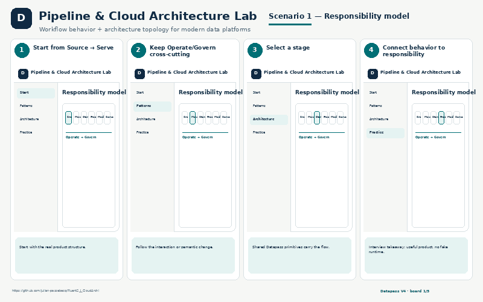

# Cloud

Cloud/data-platform architecture and pipeline projects, emphasizing reproducible engineering scenarios and architecture-as-artifact workflows.

## Pipeline & Cloud Architecture Lab

[Pipeline & Cloud Architecture Lab](Pipeline_Cloud_Architecture/) explains responsibilities, patterns, lakehouse-to-KPI flows and troubleshooting across modern data platforms.

## Contoso Forge — Pipeline Studio

[Contoso Forge](Contoso_Forge/) exercises one synthetic business scenario across pandas, Polars, DuckDB and Spark, then extends it with Delta, dbt, orchestration and evidence/QA.

**Runtime Pipeline Studio screenshot pending in this showcase.** The source can render screenshots, but the referenced runtime PNG is not committed on its current main branch.

## DrawCloud

[DrawCloud](DrawCloud/) keeps Draw.io as the visual editor and adds reusable architecture templates plus semantic JSON for Git/versioning and constrained AI-assisted diagram changes.

**Runtime screenshot pending.**

The Pipeline Architecture image is an explanatory showcase reconstruction grounded in the project, not a claimed live cloud-console capture.
