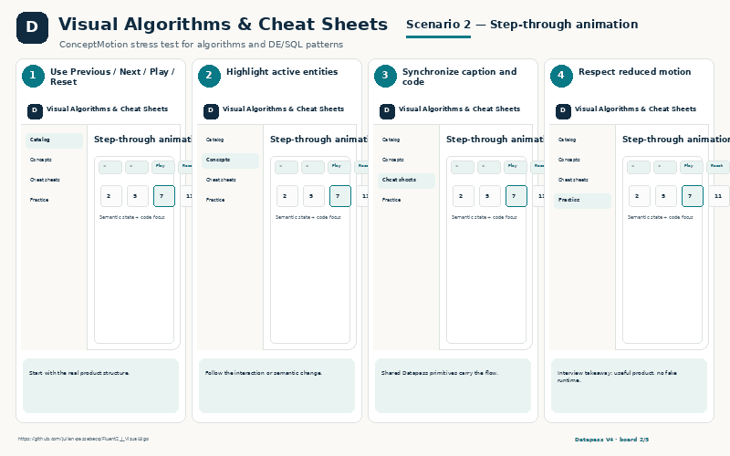
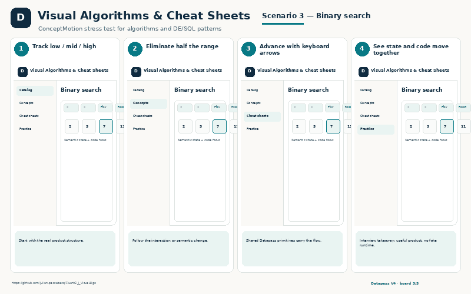
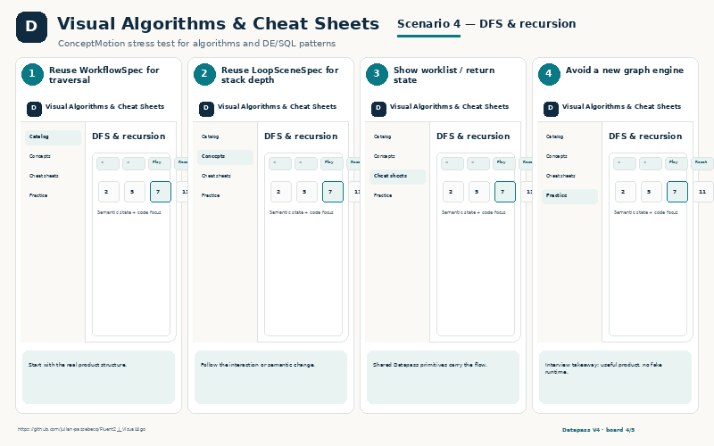
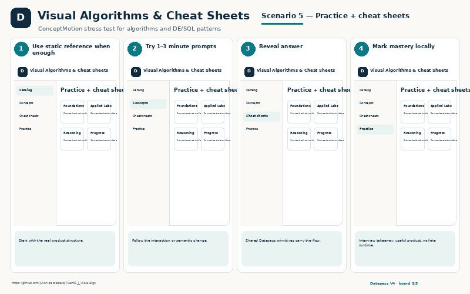

# Visual Algorithms & Cheat Sheets

ConceptMotion stress test for algorithms and DE/SQL patterns

- **GitHub:** https://github.com/julian-passebecq/Fluent2_J_VisualAlgo
- **Website:** https://fluent2jvisualalgo.netlify.app/
- **Implementation:** Semantic LoopSceneSpec / WorkflowSpec / ExplanationTrack · responsive web UI

## UI preview

> Explanatory scenario views grounded in the consumer repository, CSS, components and product behavior. They are presentation assets, not fake runtime screenshots.

## What exists now
- 33 concept pages
- Step / Play / Previous / Next / Reset
- Synchronized explanation + code focus
- 4 cheat sheets
- Local mastery + practice review

## Backlog / next version
- External canonical Figure registry package
- Traversal-state vocabulary for WorkflowSpec
- Vertical stack presentation hint
- Shared accessibility harness

## Five explanatory PNG boards
- `01_concept_catalog.png` — Concept catalog
- `02_step-through_animation.png` — Step-through animation
- `03_binary_search.png` — Binary search
- `04_dfs_and_recursion.png` — DFS & recursion
- `05_practice_+_cheat_sheets.png` — Practice + cheat sheets

## Scenario gallery

<table>
<tr>
<td></td>
<td></td>
</tr>
<tr>
<td></td>
<td></td>
</tr>
<tr>
<td></td>
</tr>
</table>
