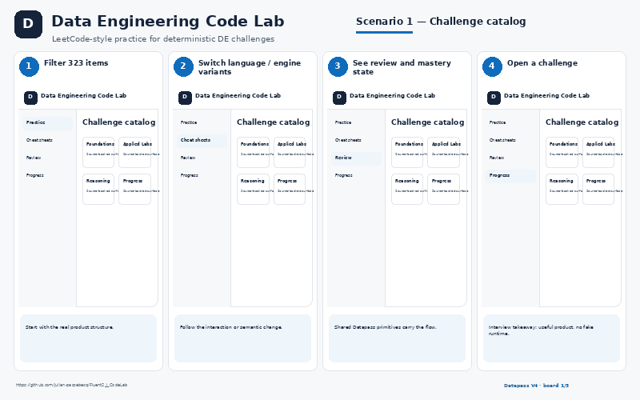
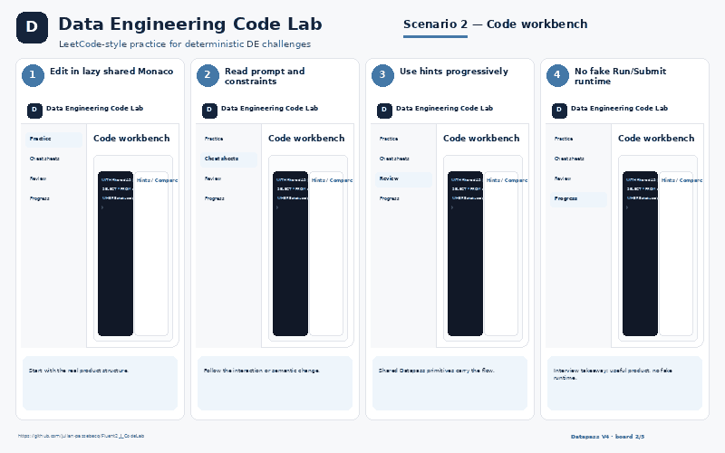
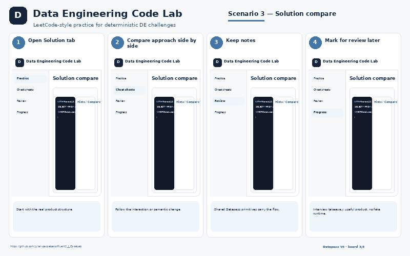
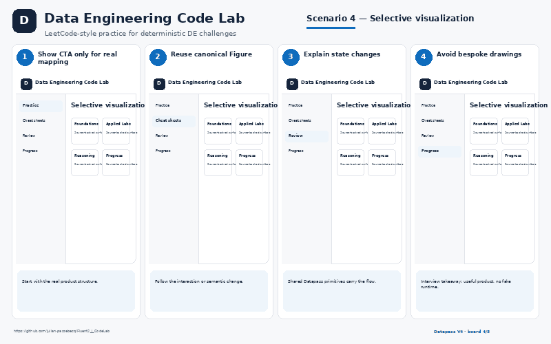
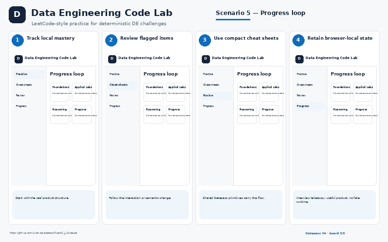

# Data Engineering Code Lab

LeetCode-style practice for deterministic DE challenges

- **GitHub:** https://github.com/julian-passebecq/Fluent2_J_CodeLab
- **Website:** Related deployed practice site: https://leetodedataeng.netlify.app/
- **Implementation:** React · TypeScript · Vite · Fluent UI · @datapass/code/learning/progress · lazy shared Monaco

## UI preview

> Explanatory scenario views grounded in the consumer repository, CSS, components and product behavior. They are presentation assets, not fake runtime screenshots.

## What exists now
- 323 deterministic items
- 500 language/engine variants
- Code / Solution / Compare
- Hints, notes, review, mastery
- Visualize only for canonical mappings

## Backlog / next version
- Portable practice-catalog package
- Mapped-only Visualize tab mode
- Cleaner cross-repo bootstrap
- Full release gate in provisioned environment

## Five explanatory PNG boards
- `01_challenge_catalog.png` — Challenge catalog
- `02_code_workbench.png` — Code workbench
- `03_solution_compare.png` — Solution compare
- `04_selective_visualization.png` — Selective visualization
- `05_progress_loop.png` — Progress loop

## Scenario gallery

<table>
<tr>
<td></td>
<td></td>
</tr>
<tr>
<td></td>
<td></td>
</tr>
<tr>
<td></td>
</tr>
</table>
