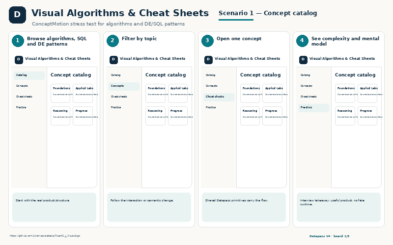

# AI-assisted Data & Developer Projects — Interview Showcase

A consolidated employer-facing index of projects I built and iterated with AI-assisted development. The emphasis is on **what the product does, the engineering choices behind it, and visual evidence** — not long code listings.

> **Evidence policy:** real runtime/QA screenshots are used when they exist. AI-generated explanatory boards are clearly labelled as reconstructions. If a current repository has no suitable screenshot, the slot is marked **pending** rather than presenting a fabricated image as a live capture.

## Portfolio map

| Area | Projects |
|---|---|
| [Tool](Tool/) | J Utility Palette · VizLens · Formation · Norsk Tech Vocabulary · Portfolio Consumer |
| [D3js](D3js/) | VizForge · Visual Algorithms |
| [Fabric](Fabric/) | Data Engineering Code Lab · Datapass Visual IT Concepts |
| [Power BI](Power%20BI/) | PbiBench |
| [Cloud](Cloud/) | Pipeline & Cloud Architecture Lab · Contoso Forge · DrawCloud |

---

# Tool

## J Utility Palette
**Windows/.NET utility · active prototype**  
Summonable project workspace for links, prompts and local context, including global mouse summon/hide behavior and persisted workspace/window state.  
[Project showcase](Tool/J_Utility_Palette/) · [Source](https://github.com/julian-passebecq/PowerToy_UI)  
**Screenshot:** pending runtime capture.

## VizLens
**Chrome extension · stable personal tool**  
Deterministically extracts visualization/page evidence, then optionally passes structured context to a local Gemini companion for interpretation.  
[Project showcase](Tool/VizLens/) · [Source](https://github.com/julian-passebecq/VizLens)  
**Screenshot:** pending runtime capture.

## Formation
**Technical learning consumer**  
Structured learning flow for foundations, SQL thinking, practice/review and source fidelity.

[Project showcase](Tool/Formation/)

## Norsk Tech & Work Vocabulary
**Learning tool**  
Work-focused Norwegian vocabulary with reveal/review mechanics and technical taxonomy.

[Project showcase](Tool/Norsk_Vocab/)

## Portfolio Consumer
**Interactive portfolio consumer**  
Experience, project and skills views designed to communicate engineering work quickly.

[Project showcase](Tool/Portfolio_Consumer/)

---

# D3js

## VizForge
**D3 visualization engine/studio · real QA capture**  
Framework-independent D3 rendering with React/Fluent consumer integration, responsive QA and flagship visualization stories.

[Project showcase](D3js/VizForge/) · [Source](https://github.com/julian-passebecq/Fluent2_J_Viz)

## Visual Algorithms & Cheat Sheets
**Educational visualization consumer**  
Step-through visual explanations for algorithms, recursion, search and practice.

[Project showcase](D3js/Visual_Algorithms/)

---

# Fabric

## Data Engineering Code Lab
**SQL/Python/data-engineering practice workbench**  
Challenge catalog, coding workbench, solution comparison and selective visualization.

[Project showcase](Fabric/Code_Lab/)

## Datapass Visual IT Concepts
**React + Fluent product bootstrap · in progress**  
Clean Microsoft/Fluent product boundary designed to selectively import proven semantic/rendering components instead of carrying an old monorepo forward.  
[Project showcase](Fabric/Visual_IT_Concepts/) · [Source](https://github.com/julian-passebecq/Fluent2_Microsoft_J)  
**Screenshot:** pending; current repository is intentionally an in-progress bootstrap.

---

# Power BI

## PbiBench
**C#/.NET Power BI + Fabric engineering workbench · architecture/implementation stage**  
One shell for semantic-model editing, DAX workflows, automation, PBIP/Git, QA and Fabric control-plane work.  
[Project showcase](Power%20BI/PbiBench/) · [Source](https://github.com/julian-passebecq/powerbi_enhanced_dev)  
**Screenshot:** pending; the current source is a detailed implementation handoff, not a finished runtime UI.

---

# Cloud

## Pipeline & Cloud Architecture Lab
**Architecture learning / troubleshooting consumer**  
Responsibility models, pipeline patterns, cloud lenses, lakehouse-to-KPI flow and QA/troubleshooting.

[Project showcase](Cloud/Pipeline_Cloud_Architecture/)

## Contoso Forge — Pipeline Studio
**Multi-engine data engineering**  
One reproducible scenario across pandas, Polars, DuckDB and Spark, extended with Delta, dbt, orchestration and evidence/QA.  
[Project showcase](Cloud/Contoso_Forge/) · [Source](https://github.com/julian-passebecq/Contoso-Data-Generator-V2)  
**Screenshot:** pending in the showcase. The app contains screenshot-rendering code, but its referenced runtime PNG is not committed on current `main`.

## DrawCloud
**Cloud architecture workbench**  
Draw.io-first diagram workflow with semantic JSON for versioning and constrained AI-assisted edits.  
[Project showcase](Cloud/DrawCloud/) · [Source](https://github.com/julian-passebecq/DrawCloud)  
**Screenshot:** pending runtime capture.

---

## Visual asset coverage

See [`ASSET_STATUS.md`](ASSET_STATUS.md) for the exact PNG inventory, evidence type, and missing-capture backlog.

## Archived previous layout

The pre-consolidation repository — including the older website showcase pack, partial stopped-agent uploads and the original Datapass folder layout — is preserved on branch **`backup-v1`**. Those legacy website experiments are intentionally not shown on the employer-facing `main` branch.
