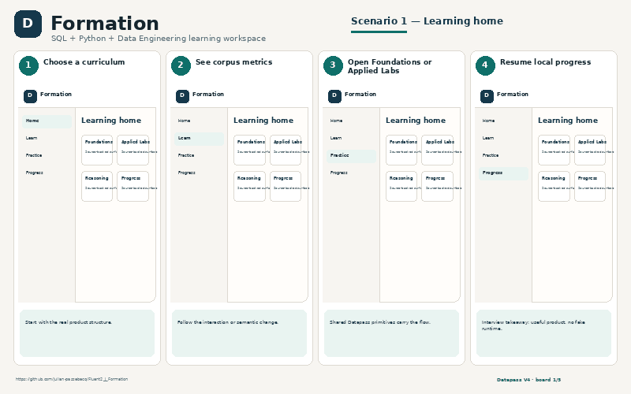
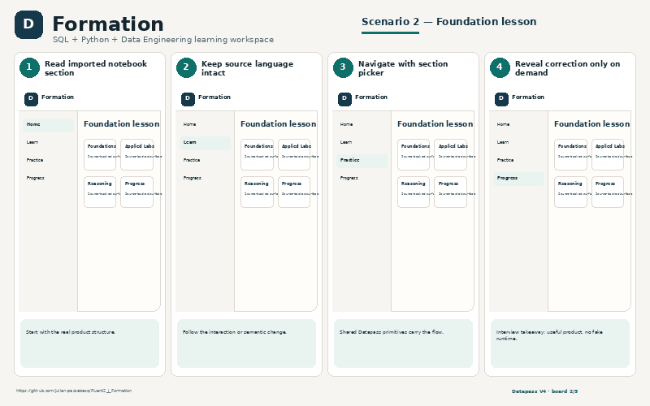
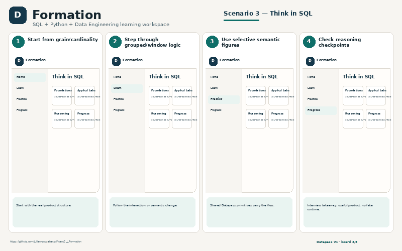
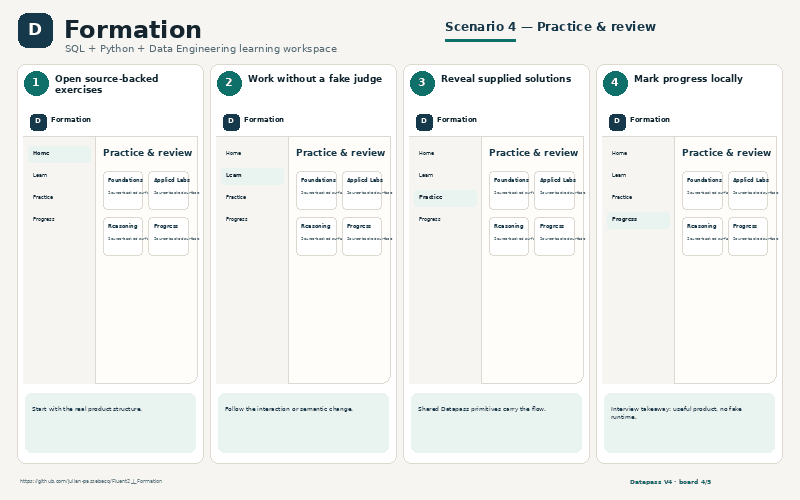
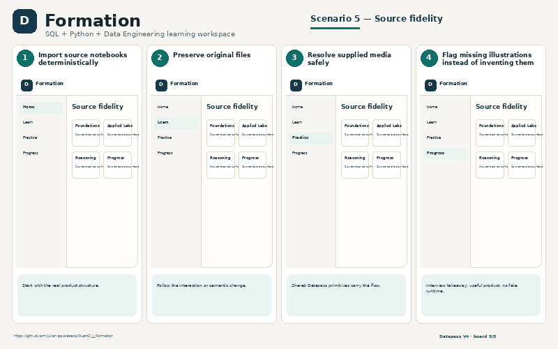

# Formation

SQL + Python + Data Engineering learning workspace

- **GitHub:** https://github.com/julian-passebecq/Fluent2_J_Formation
- **Website:** No public deployment claimed in repository
- **Implementation:** React · TypeScript · Vite · Fluent UI · Datapass V4 notebook/content/figure/progress

## UI preview

> Explanatory scenario views grounded in the consumer repository, CSS, components and product behavior. They are presentation assets, not fake runtime screenshots.

## What exists now
- SQL Foundations 0.A–0.C + chapters 1–8
- 39 SQL Applied Labs
- Think in SQL reasoning layer
- Gated corrections/solutions
- Local progress & review

## Backlog / next version
- Publish portable V4 packages
- First-class sectioned notebook primitive
- Stable shared visual registry
- Reusable SQL window-frame semantic treatment

## Five explanatory PNG boards
- `01_learning_home.png` — Learning home
- `02_foundation_lesson.png` — Foundation lesson
- `03_think_in_sql.png` — Think in SQL
- `04_practice_and_review.png` — Practice & review
- `05_source_fidelity.png` — Source fidelity

## Scenario gallery

<table>
<tr>
<td></td>
<td></td>
</tr>
<tr>
<td></td>
<td></td>
</tr>
<tr>
<td></td>
</tr>
</table>
