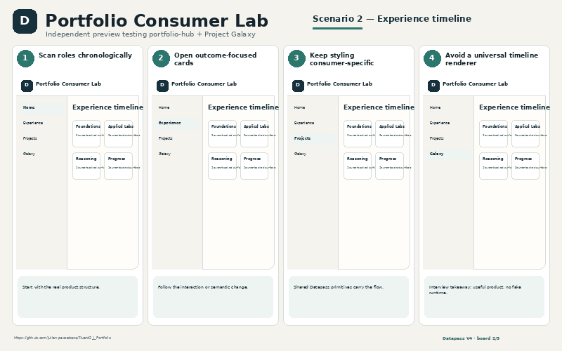
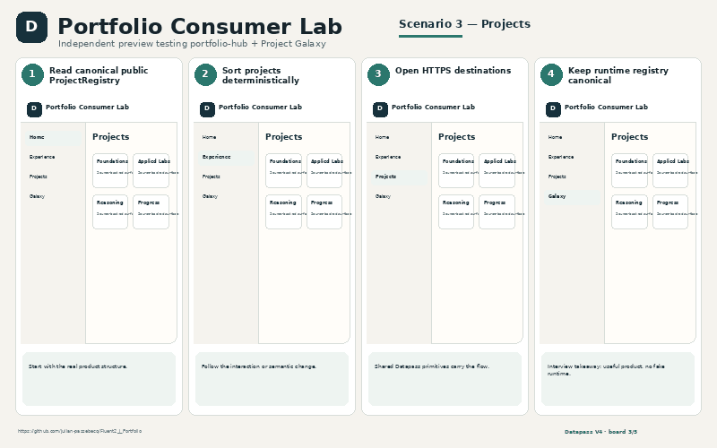
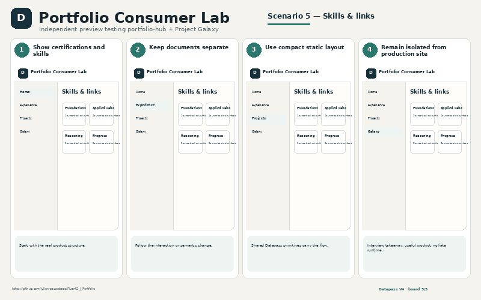

# Portfolio Consumer Lab

Independent preview testing portfolio-hub + Project Galaxy

- **GitHub:** https://github.com/julian-passebecq/Fluent2_J_Portfolio
- **Website:** Separate preview design; repository explicitly avoids datapassj.com production binding
- **Implementation:** React · TypeScript · Fluent UI · ProjectRegistry · DiagramSpec · shared radial Project Galaxy

## UI preview

> Explanatory scenario views grounded in the consumer repository, CSS, components and product behavior. They are presentation assets, not fake runtime screenshots.

## What exists now
- Career axis
- Experience timeline
- ProjectRegistry grid
- Skills & certifications
- Semantic Project Galaxy
- Links/documents

## Backlog / next version
- Portable public ProjectRegistry export
- Shared ProjectRegistry → DiagramSpec helper
- Cross-repo portfolio scaffold mode
- Wide Figure phone presentation guidance

## Five explanatory PNG boards
- `01_home_positioning.png` — Home positioning
- `02_experience_timeline.png` — Experience timeline
- `03_projects.png` — Projects
- `04_project_galaxy.png` — Project Galaxy
- `05_skills_and_links.png` — Skills & links

## Scenario gallery

<table>
<tr>
<td></td>
<td></td>
</tr>
<tr>
<td></td>
<td></td>
</tr>
<tr>
<td></td>
</tr>
</table>
