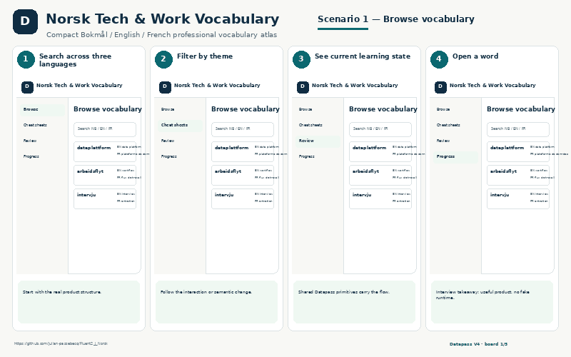
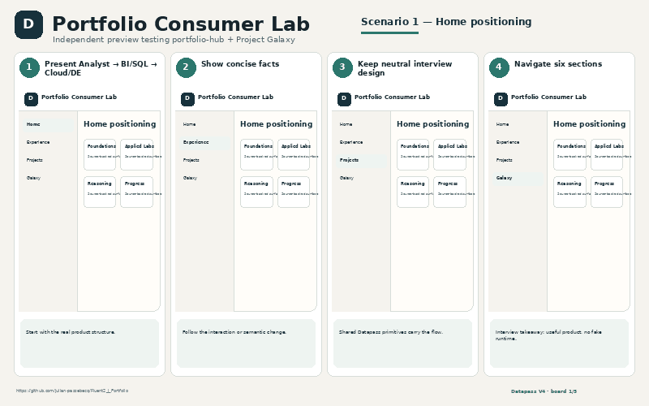

# Tool

Small products and learning/portfolio consumers built to solve concrete workflow problems.

| Project | Purpose | Visual |
|---|---|---|
| [J Utility Palette](J_Utility_Palette/) | Windows/.NET summonable workspace and prompt utility | Runtime screenshot pending |
| [VizLens](VizLens/) | Chrome visualization inspection + optional local AI interpretation | Runtime screenshot pending |
| [Formation](Formation/) | Structured technical learning consumer |  |
| [Norsk Tech & Work Vocabulary](Norsk_Vocab/) | Work-focused Norwegian vocabulary practice |  |
| [Portfolio Consumer](Portfolio_Consumer/) | Interactive portfolio/experience consumer |  |

The Datapass images above are **explanatory showcase reconstructions** grounded in the project UI/content; they are not labelled as literal runtime captures. Project pages contain the full five-image scenario sets.
