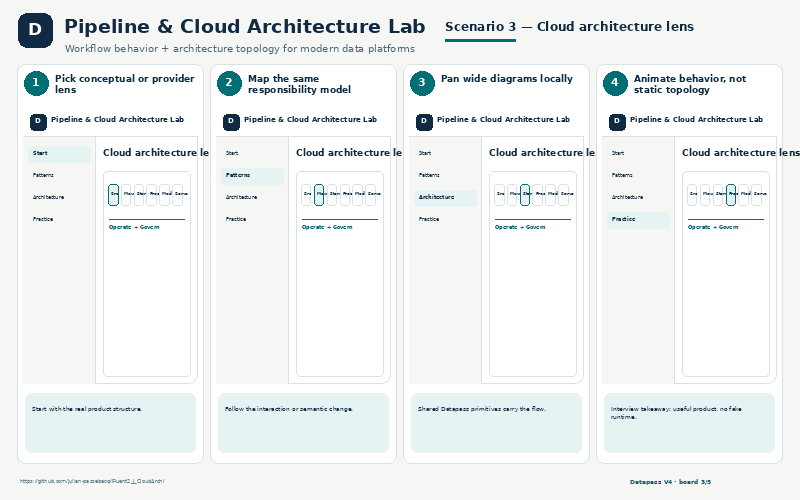
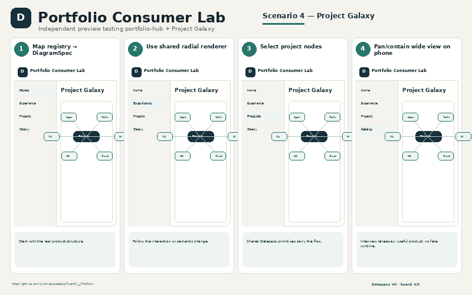

# Datapass V4 — Six Consumer Interview Showcase

Five explanatory PNG boards per consumer. The boards are presentation-oriented UI reconstructions grounded in current repositories, product copy, CSS tokens, component structure and available deployment evidence.

## At-a-glance UI previews

<table>
<tr>
<td><b>Formation</b> </td>
<td><b>Data Engineering Code Lab</b> </td>
</tr><tr>
<td><b>Visual Algorithms & Cheat Sheets</b> </td>
<td><b>Pipeline & Cloud Architecture Lab</b> </td>
</tr><tr>
<td><b>Norsk Tech & Work Vocabulary</b> </td>
<td><b>Portfolio Consumer Lab</b> </td>
</tr>
</table>

## Shared engineering story

- Six independent consumers were used to validate Datapass V4 with real product requirements.
- React/TypeScript/Fluent consumers reuse shared Datapass packages and semantic Figure/Workflow/Diagram contracts.
- Local-only progress is used where appropriate; no backend/auth/cloud sync is invented.
- No fake SQL/Spark/Python execution or universal judge is claimed.
- Repeated framework friction is primarily cross-repository consumption because V4 is not yet a published SDK.

## Project index

| Project | GitHub | Website | Current scope | Next-version focus |
|---|---|---|---|---|
| Formation | https://github.com/julian-passebecq/Fluent2_J_Formation | No public deployment claimed in repository | SQL Foundations 0.A–0.C + chapters 1–8; 39 SQL Applied Labs; Think in SQL reasoning layer | Publish portable V4 packages; First-class sectioned notebook primitive |
| Data Engineering Code Lab | https://github.com/julian-passebecq/Fluent2_J_CodeLab | Related deployed practice site: https://leetodedataeng.netlify.app/ | 323 deterministic items; 500 language/engine variants; Code / Solution / Compare | Portable practice-catalog package; Mapped-only Visualize tab mode |
| Visual Algorithms & Cheat Sheets | https://github.com/julian-passebecq/Fluent2_J_VisualAlgo | https://fluent2jvisualalgo.netlify.app/ | 33 concept pages; Step / Play / Previous / Next / Reset; Synchronized explanation + code focus | External canonical Figure registry package; Traversal-state vocabulary for WorkflowSpec |
| Pipeline & Cloud Architecture Lab | https://github.com/julian-passebecq/Fluent2_J_CloudArchi | https://f2jcloudarchi.netlify.app/ | DAGs, retries, backfills, CDC; Source→Move→Store→Process→Model→Serve; Fabric / Databricks / GCP / Azure lenses | Keep provider terminology snapshots current; Further tighten cross-repo package closure |
| Norsk Tech & Work Vocabulary | https://github.com/julian-passebecq/Fluent2_J_Norsk | No public deployment found in current Netlify project list | 215 terms / 5 themes; NB + EN + FR search; Theme & learning-state filters | Locale-keyed lexical translation map; Entity-neutral mastery/review primitive |
| Portfolio Consumer Lab | https://github.com/julian-passebecq/Fluent2_J_Portfolio | Separate preview design; repository explicitly avoids datapassj.com production binding | Career axis; Experience timeline; ProjectRegistry grid | Portable public ProjectRegistry export; Shared ProjectRegistry → DiagramSpec helper |
